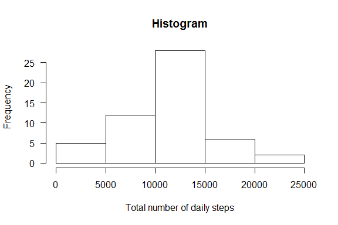
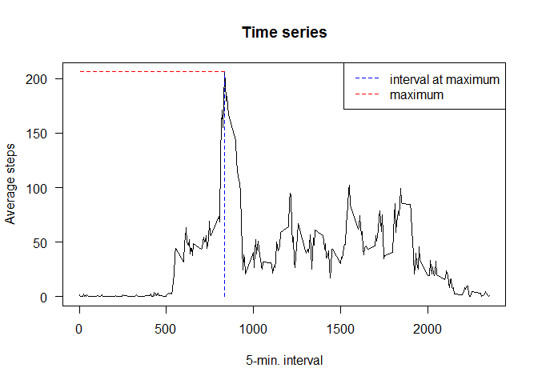
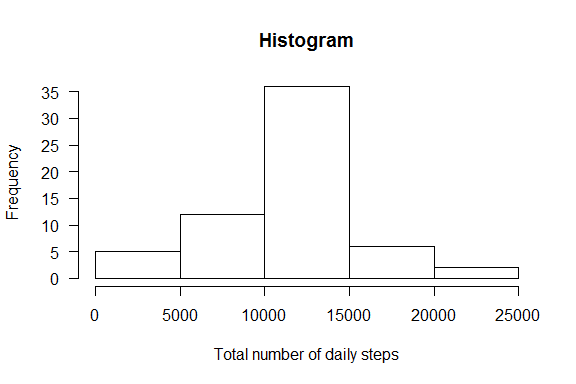
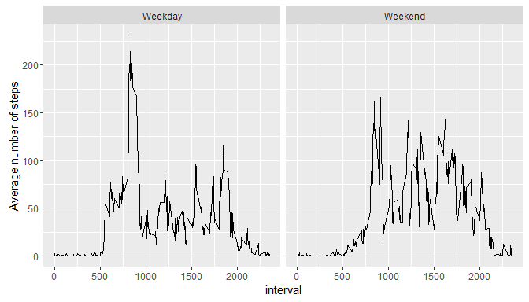

# Course Project 1
Albert Cobos  
15 de noviembre de 2016  


## Loading and preprocessing the data

The following code chunck reads the data and performs some data preparation tasks, such as:

- computing the total steps per day (`tspd`)
- computing the average steps per 5-minute interval (`asp5`)

Variable `tspd` was computed **for days with no missings**, that is, not removing NAs (since removing missings with `na.rm=TRUE` in the `sum` function resulted in severe underestimation, due to sevaral days with no data at all).

Variable `asp5` was computed removing NAs with option `na.rm=TRUE`.


```r
# reading the data
d <- read.csv("activity.csv")

# computing derived vars
tspd <- tapply(d$steps, d$date, sum)
asp5 <- tapply(d$steps, d$interval, mean, na.rm=TRUE)
```

The resulting dataframe, having 17568 rows and 3 columns, correspond to the number of steps taken in each 5-minute interval, during 61 days.   

## What is mean total number of steps taken per day?

The following plot shows the histogram of the total number of daily steps. Note that there were 8 days with unknown total number of steps due to missing data.


```r
hist(tspd, main="Histogram", xlab="Total number of daily steps", las=1)
```



The mean and median number of daily steps are shown in the following output, among other descriptive statistics.


```r
summary(tspd)
```

```
##    Min. 1st Qu.  Median    Mean 3rd Qu.    Max.    NA's 
##      41    8841   10760   10770   13290   21190       8
```

## What is the average daily activity pattern?


```r
# determining max and interval aat which max occurs (the actual values will be shown in text using inline r code)
max <- max(asp5)
xmax <- as.numeric(names(asp5)[asp5==max(asp5)])

plot(as.numeric(names(asp5)), asp5, type="l", main="Time series", las=1, xlab='5-min. interval', ylab="Average steps")
segments(xmax,0,xmax,max, lty=2, col="blue")
segments(xmax,max,0,max, lty=2, col="red")
legend("topright", c("interval at maximum", "maximum"), lty=2, col=c("blue","red"))
```

<!-- -->

These are the actual values, shown using inline R code: the (rounded) maximum average steps was `max` =  206, which corresponds to the `xmax`=  835 interval.

## Imputing missing values

The following shows the number of missings in the dataframe. There are no missings in variables `date` or `ìnterval`, but there are 2304 missings in `steps`. 

It was considered more convenient to use the 5-minutes interval mean to substitute missings, rounding this value to the closest integer. This is done in the following chunk.


```r
colSums(is.na(d))  # number of NAs per variables
```

```
##    steps     date interval 
##     2304        0        0
```

```r
# missing substitution
dd <- merge(d,data.frame(interval=row.names(asp5), asp5))       # getting 5-min specific averages
dd$steps <- ifelse(is.na(dd$steps), round(dd$asp5), dd$steps)   # if step is missing, use average
dd <- dd[,c(2,3,1)] # reordering vars and dropping asp5 to get same structure as d

# and computing (new) totals per day andaverages per 5-min interval
# computing derived vars
new.tspd <- tapply(dd$steps, dd$date, sum)
new.asp5 <- tapply(dd$steps, dd$interval, mean)
```


## Repeating the analysis of steps per day after missing substitution


```r
hist(new.tspd, main="Histogram", xlab="Total number of daily steps", las=1)
```


 The mean and median number of daily steps are shown in the following output, among other descriptive statistics. These values are equal to those computed before the missing substitution.
 


```r
summary(new.tspd)
```

```
##    Min. 1st Qu.  Median    Mean 3rd Qu.    Max. 
##      41    9819   10760   10770   12810   21190
```

## Are there differences in activity patterns between weekdays and weekends?

```r
# creating the wday factor (weekend or weekday)
weekend <- c("sábado","domingo")
dd$wday <- ifelse(weekdays(as.Date(dd$date)) %in% weekend, "Weekend", "Weekday")

# computing 5-min averages by wday
ddav <- aggregate(dd$steps, by=list(interval=dd$interval, wday=dd$wday), FUN=mean)

library(ggplot2)
qplot(interval, x, data=ddav, facets= ~ wday, geom = "line", ylab = "Average number of steps")
```



The following plot shows that maximum activity is gihgher in weekdays, but average activity seems to be higher during weekends, which is further verified in the following chunk.

```r
tapply(ddav$x,ddav$wday, summary)
```

```
## $Weekday
##    Min. 1st Qu.  Median    Mean 3rd Qu.    Max. 
##   0.000   2.289  25.810  35.610  50.810 230.400 
## 
## $Weekend
##    Min. 1st Qu.  Median    Mean 3rd Qu.    Max. 
##   0.000   1.234  32.310  42.360  74.610 166.600
```

